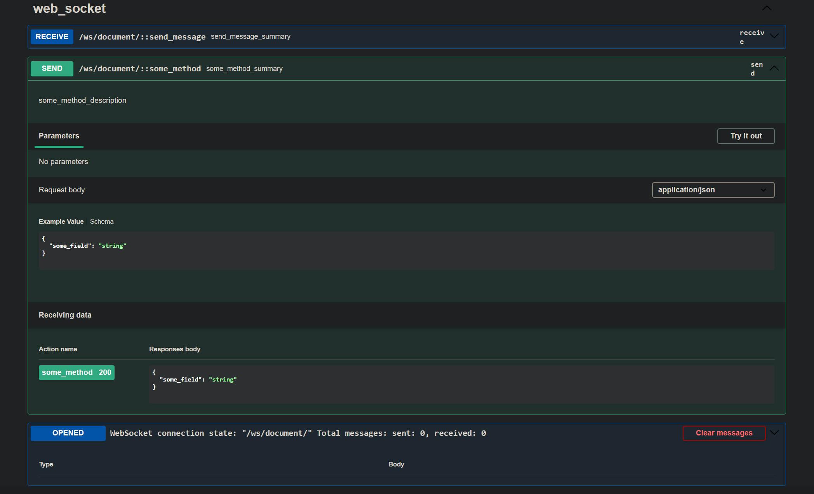
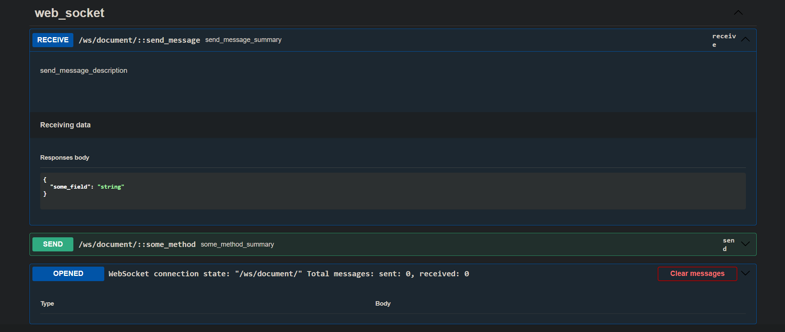

# Extend websocket schema decorator for Django Channels


> Provides [extend_ws_schema](#About-decorator) decorator to documentation [Cunsumer](https://channels.readthedocs.io/en/latest/topics/consumers.html) methods from [channels](https://github.com/django/channels) just like it does [drf-spectacular](https://github.com/tfranzel/drf-spectacular)


## Install
1. `pip install drf-spectacular-websocket`
2. `python manage.py collectstatic` for sidecar static
3. Add app name to `INSTALLED_APPS`
```python
INSTALLED_APPS = [
    # drf_spectacular_websocket must be higher than drf_spectacular
    'drf_spectacular_websocket',
    'drf_spectacular',
    'drf_spectacular_sidecar',
]
```


## Configure settings
```python
ASGI_APPLICATION = 'path.to.your.application'

# default settings (there is no need to define in your application)
SPECTACULAR_SETTINGS = {
    'DEFAULT_GENERATOR_CLASS': 'drf_spectacular_websocket.schemas.WsSchemaGenerator',
    'SWAGGER_UI_DIST': 'SIDECAR',
    'SWAGGER_UI_FAVICON_HREF': 'SIDECAR',
    'REDOC_DIST': 'SIDECAR',
    'SWAGGER_UI_SETTINGS': {
        'connectSocket': True,  # Automatically establish a WS connection when opening swagger
        'socketMaxMessages': 8,  # Max number of messages displayed in the log window in swagger
        'socketMessagesInitialOpened': False,  # Automatically open the log window when opening swagger
    },
}

# you can override this default settings in your application:
# connectSocket
# socketMaxMessages
# socketMessagesInitialOpened
```


## About decorator
drf_spectacular_websocket `extend_ws_schema` accepts one new `type` parameter relative to drf_spectacular `extend_schema`.
- `type`
    - `send` - Type of interaction, [request -> response]
    - `receive` - Type of interaction, [response without request]


## Usage example

> drf_spectacular_websocket automatically finds websocket urls and related consumer using `ASGI_APPLICATION` setting.

Direct usage

```python
from channels.generic.websocket import AsyncJsonWebsocketConsumer
from rest_framework.serializers import Serializer, CharField
from drf_spectacular_websocket.decorators import extend_ws_schema


class SomeMethodInputSerializer(Serializer):
    some_field = CharField()


class SomeMethodOutputSerializer(Serializer):
    some_field = CharField()


class SendMessageOutputSerializer(Serializer):
    some_field = CharField()


class SomeConsumer(AsyncJsonWebsocketConsumer):

    async def receive_json(self, content, **kwargs):
        some_value = content.get('some_key')
        if some_value:
            await self.some_method(some_value)

    @extend_ws_schema(
        type='send',
        summary='some_method_summary',
        description='some_method_description',
        request=SomeMethodInputSerializer,
        responses=SomeMethodOutputSerializer,
    )
    async def some_method(self, some_value):
        input_serializer = SomeMethodInputSerializer(data=some_value)
        input_serializer.is_valid(raise_exception=True)

        return_value = await some_business_logic(input_serializer.validated_data)

        output_serializer = SomeMethodOutputSerializer(data=return_value)
        output_serializer.is_valid(raise_exception=True)

        await self.send_json(output_serializer.validated_data)

    @extend_ws_schema(
        type='receive',
        summary='send_message_summary',
        description='send_message_description',
        request=None,
        responses=SendMessageOutputSerializer,
    )
    async def send_message(self, message):
        await self.send_json(message)
```

### Send


### Receive

